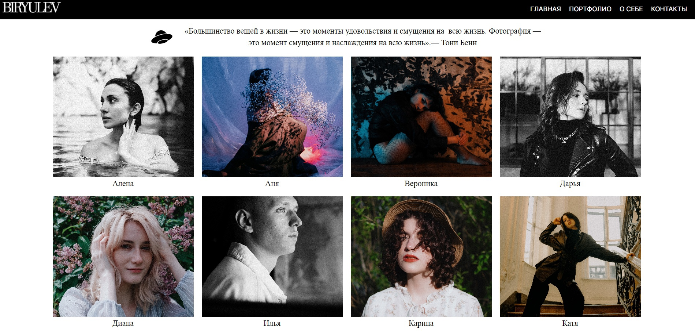
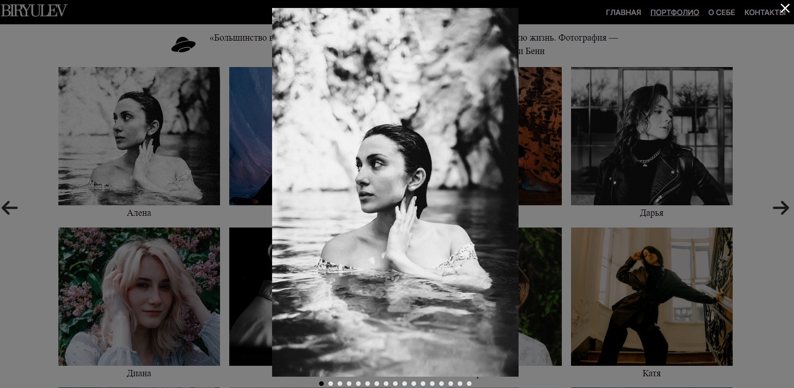
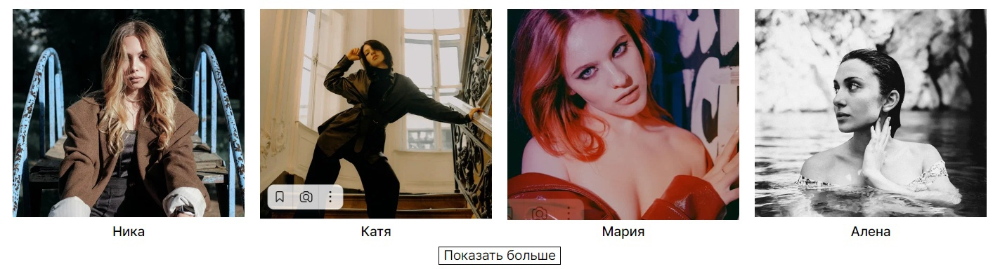

# Проект: Сайт-портфолио для фотографа(проект находится на стадии разработки)

- проект разрабатывается, как собстевнный pet-проект с целью изучения новых технологий и закрепления навыков frontend разработки.

## Содержание

 - [Обзор проекта](#обзор-проекта)
    - [Задачи и цели](#задачи-и-цели-проекта)
    - [Функциональность проекта](#функциональность-проекта)
    - [Будущие улучшения](#будущие-улучшения)
    - [Ссылки](#ссылки)
    - [Директории проекта](#директории-проекта)
    - [Запуск прокета](#запуск-проекта)
 - [Технологии](#технологии)
 - [Автор](#автор)

## Обзор проекта

### Задачи и цели проекта

Задачи проекта включают в себя интеграция в проект хранилища для хранения данных(хранение фотографий с возможностью обновления в реальном времени), закреплений навыков в верстке и создания SPA страниц, изучение технологий и добавления различного функционала в работу.
К целям проекта относятся создание сайта для фотографа, верстка с помощью созданного макета в Figma, написание функционала приложения, подключение api хранилища с фотографиями.

### Функциональность проекта

Проект представляет полноценный сайт для фотографа, на данный момент реализовано 4 страницы (главная/портфолио/о себе/контакты). В дальнейшем планируется добавить страницы с услагами и ценами, а также страницу "Блог", в которой будет реализована лента с фотографиями/статьями от фотографа.
В работе подключено api с хранилищем фотосессий(разбыты по папкам), для пополнения портфолио автору достаточно залить папку с фотографиями на диск и содержимое сразу отобразиться на сайте.

Реализован слайдер для просмотра всех фотографий с отдельной фотосессии

Реализована функция "Показать больше" на странице с портфолио

### Будущие улучшения

В проект планируется добавить:

  - страницу с услугами фотографа
  - форма для записи клиентов на фотосессию
  - оптимизацию сайта для быстродействия
  - изменить страницу с просмотрами всех фотографий с фотосессии

### Ссылки

[Ссылка на страницу сайта](https://ilyabiryulev.github.io/photographer-s-website/#/)

[Ссылка на проект](https://github.com/IlyaBiryulev/photographer-s-website)

### Директории проекта

- `src/components` — компоненты проекта
- `src/contexts` — элементами контекста
- `src/utils` — директория с api, константами и вспомогательными функциями проекта
- `src/image` — изображения
- `src/vendor` — директория с файлами библиотек
- `/fonts` — директория со шрифтами

### Запуск проекта

- `npm run build` — запуск проекта в режиме продакшн
- `npm start` — запуск проекта в режиме разработки

## Технологии

- HTML
- CSS
- JS
- React
- React Router
- Create React App
- Axios
- Адаптивная вёрстка
- Семантическая вёрстка

## Автор

Илья Бирюлев

- e-mail: birulevila@gmail.com
- tg: [@ilya_bir](https://t.me/ilya_bir)
